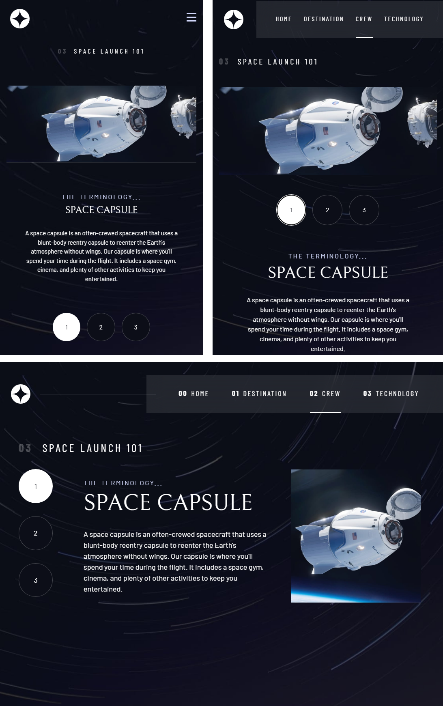

# Frontend Mentor - Space tourism website solution

This is a solution to the [Space tourism website challenge on Frontend Mentor](https://www.frontendmentor.io/challenges/space-tourism-multipage-website-gRWj1URZ3).

## Table of contents

- [Overview](#overview)
  - [The challenge](#the-challenge)
  - [Screenshot](#screenshot)
- [My process](#my-process)
  - [Built with](#built-with)
  - [What I learned](#what-i-learned)

## Overview

### The challenge

Users should be able to:

- View the optimal layout for each of the website's pages depending on their device's screen size
- See hover states for all interactive elements on the page
- View each page and be able to toggle between the tabs to see new information

### Screenshot

## My process

### Built with

- Semantic HTML5 markup
- CSS custom properties
- Flexbox
- CSS Grid
- Mobile-first workflow

### What I learned

- 'sr-only' removes it visually but it is still in DOM. display: none - removes from DOM.
- hsl destructuring for better performance in color managment and possibility to add /alpha
- 'flow > ** + **' same as 'flow > \*:not(:first-child)' // not the first child of flow
- aspect-ratio insted of w and h.
- minmax()
- aria-hidden = "true" - visible but not for screen readers
- p:not([class]) means p's without class
